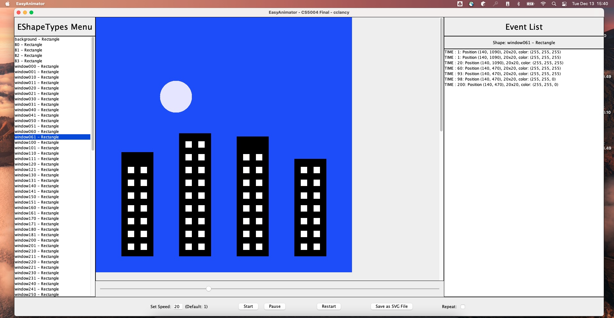

 # Final Project 
 ## Overview
 The capstone project for this class involved making a program following the Model View Controller 
 (MVC) framework.  This program can be used via the command line, and produces a Graphical User
 Interface (GUI), an `.svg` file or a `.txt` file. 
 

## Command-line Examples
GUI Example: 
~~~ 
java -jar final.jar -view gui -in ./buildings.txt -speed 20
~~~

SVG Example: 
~~~
java -jar final.jar -view svg -out ./output.svg -in ./toh-12.txt -speed 20
~~~

Text Example:
~~~
java -jar final.jar -view text -in ./toh-3.txt -out textOutput.txt -speed 20         
~~~

## Program Classes 
### Model

| Class         | Interface  | Description                                                                 |
|:--------------|:-----------|:----------------------------------------------------------------------------|
| Model         | IModel     | The class that contains the model for this program.                         | 
| AbstractShape | IShape     | This class represents a shape in the model.                                 |
| Animation     | IAnimation | This class represents Animations that shapes can perform in an automation.  |
| Ellipse       |            | Extends AbstractShape and represents Ellipse objects.                       |
| Rectangle     |            | Extends AbstractShape and represents Rectangle objects.                     |

### View
| Class            | Interface           | Description                                                                                                                                          |
|:-----------------|:--------------------|:-----------------------------------------------------------------------------------------------------------------------------------------------------|
| ViewFile         | IView               | This class creates `.svg` or `.txt` file representations of the model                                                                                |
| ViewGUIEditor    | IView               | This class creates a GUI to display and interact with the model.                                                                                     |
| PaintPanel       | IPaintPanel         | Represents a JPanel for the GUI that contains all of the shapes for the animation.                                                                   | 
| ShapeCell        | IShapeCell          | This class represents a shape within the animation.                                                                                                  |
| FrameChangeEvent | IFrameChangeEvent   | This class represents a change in a frame in the animation.                                                                                          |
| ShapeChangeEvent | IShapeChangeEvent   | This class represents a change in a shape in the animation.                                                                                          |
| UserInputHandler | IUserInputHandler   | This class handles button clicks, user inputs, and error messages in the GUI.                                                                        |
| *ViewGUISimple   | IView               | This was the original GUI implementation, but was replaced with `ViewGUIEditor` to comply with the MVC framework and provide better functionality.   |

### Controller 
| Class      | Interface   | Description                                                                               |
|:-----------|:------------|:------------------------------------------------------------------------------------------|
| Controller | IController | The class that contains the controller for this program.                                  |
| Frame      | IFrame      | This class represents a single `tick` or image of the animation at a given point in time. |

